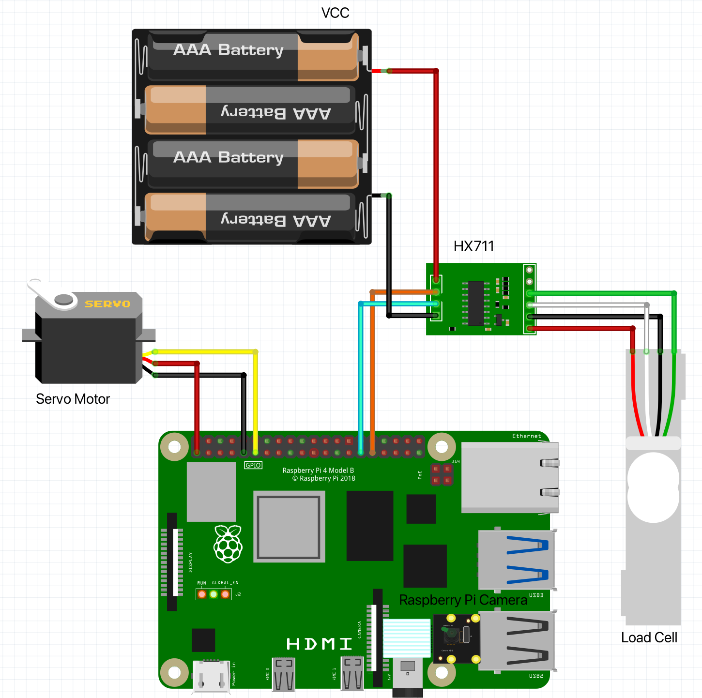

# Calorie Counter
SYSC 3010 Project
L1-G3

## Project Description:
The calorie counter will perform 4 main tasks: count the total daily calories consumed and relay it back to the user in a GUI; scan barcodes of the food products using a Raspberry Pi camera alongside a barcode database; displaying the progress of an individual user on a Raspberry Pi Sense Hat and on the Web GUI; and measuring the amount of pre-packaged food consumed and relaying it back to the database. To accomplish these 4 main tasks we have broken our project down to its functional requirements. 

### Online Database:
The first step is to set up an accessible database to contain all required user info, ID’s for the various user devices, and nutrition item info. 
### Server:
A server is required to handle requests from the Web Application and the RPI Controller. 
### Barcode Scanner:
The next functional requirement is to program the camera to identify and scan barcodes. 
### RPI Controller:
The RPI Controller will operate the camera, weight sensor and rotating platform. Furthermore, the RPI Controller must be able to communicate bi-directionally with the server.
### Web Application:
Lastly, this project requires a bi-directional Web Application for users to login, send a request to scan items and access their information at any time.

## Setup/Installation:
Before Setting up our project, it is important to note that there are a lot of hardware components used. Please refer below the setup steps to see the list the hardware requirements.

### Hardware Components
- Servo Motor
- Raspberry Pi Camera Module V2
- Load Cell
- HX711 Sensor
- SenseHat
- 3x Raspberry Pi
### Connecting Hardware components
1. To connect the servo motor follow the description below.
-  Motor's VCC (Red) ⟶ Raspberry Pi 3.3V Pin
-  Motor's GND (Brown/Black) ⟶ Raspberry Pi GND Pin
-  Motor's Pulse ⟶ Raspberry Pi Pin 11 (GPIO 17)

The camera is connected the camera port. More information on how to connect and setup the camera can be found [here](https://thepihut.com/blogs/raspberry-pi-tutorials/16021420-how-to-install-use-the-raspberry-pi-camera).
3. On the same Raspberry Pi as the camera, connect the load cell to the HX711 sensor as described below.
- E+ ⟶ Red
- E- ⟶ Black
- A+ ⟶ White
- A- ⟶ Green

From there, connect the HX711 sensor to the RPi and the 4V - 6V power source.
- VCC ⟶ Positive Pin of power source
- DT ⟶ Raspberry Pi Pin 29 (GPIO 5)
- SCK ⟶ Raspberry Pi Pin 31 (GPIO 6)
- GND ⟶ Negative Pin of power source

The result should be as shown below:

### Installing Software
1. Using our repository, clone the following files to the following Raspberry Pi's. Make sure the files are located in the same directory.

| RPI Controller: | RPI Server: | RPI Display:             |
|-----------------|-------------|--------------------------|
|                 |             | RPI_Display.py           |
|                 |             | RPI_Display_Functions.py |
|                 |             | RPI_Display_Register.py  |

2. Register a user to the RPI Display by running the RPI_Display_Register.py. Enter a valid user and corresponding user email that already has been registered using the web application. (Note the program can be used to change the usesr registered to the device.)
3. Run RPI_Display.py. This program will run/idle until an event occurs.

## Team Members:
Student A: Thomas Knechtel

Student B: Keith Lam

Student C: Dhriti Aravind

